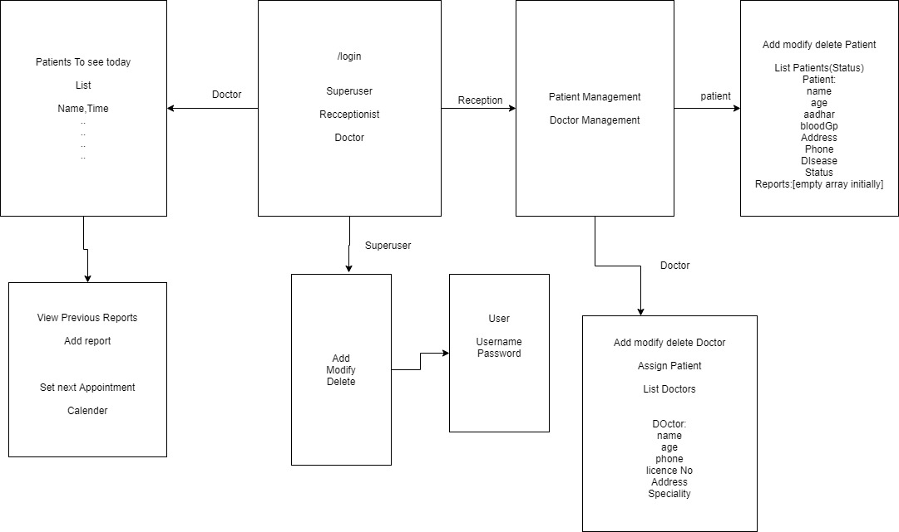

# hospMgmt

 A Django Web application for facilitation of patient registration, assigning doctor, doctor availability etc 

Steps to operate
Createsuperuser
Login on Admin Page and Create a receptionist with permissions to add, delete,modify patients and docs
Create Doctors 
Create Patient and Assign a Doctor. You can modify any patients also
Goto Doctor App and Login> Youll see a list of patients scheduled for the day
Select a patient from the list
View Details and Reports. You can also add any report
